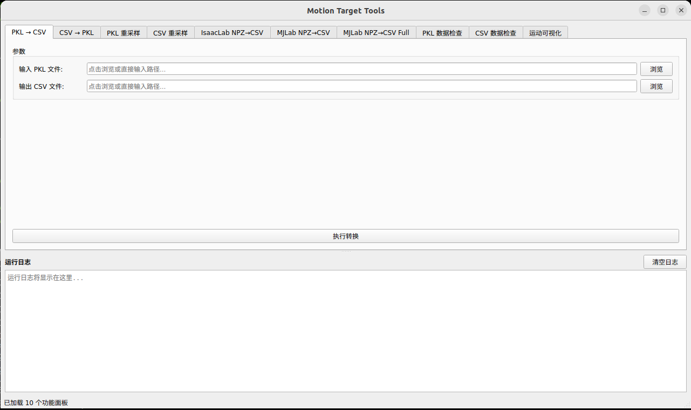

# Humanoid Motion Convert

PM01 人形机器人运动数据处理与可视化工具。

## GUI 界面



## 运行

需要 python3.8
```bash
python -m gui.main
```

## 1. PKL可以用于twist，是由GMR转换来的。格式必须是：
```
==================================================
FPS        : 30
root_pos                 : (143, 3)  dtype=float64
root_rot                 : (143, 4)  dtype=float64
dof_pos                  : (143, 24)  dtype=float64
local_body_pos           : torch.Size([143, 29, 3])  dtype=torch.float32
link_body_list           : len=29
==================================================
```
## 2. csv可以用来unity软件的可视化。格式必须是：
```
==================================================
root_pos shape: (143, 3)
root_rot shape: (143, 4)
dof_pos shape: (143, 24)
==================================================
```
## 3. 他们的csv和mjlab、beyondmimic的csv维度不一样

## 4. 如果是要给ASAP用，它的pkl格式是：

```
==================================================
FPS        : 50
root_trans_offset        : (630, 3)  dtype=float32
pose_aa                  : (630, 29, 3)  dtype=float32
dof                      : (630, 24)  dtype=float32
root_rot                 : (630, 4)  dtype=float32
body_pos_w               : (630, 29, 3)  dtype=float32
body_quat_w              : (630, 29, 4)  dtype=float32
body_lin_vel_w           : (630, 29, 3)  dtype=float32
body_ang_vel_w           : (630, 29, 3)  dtype=float32
joint_vel                : (630, 24)  dtype=float32
source_format            : 'npz_converted_for_asap'
==================================================
```
